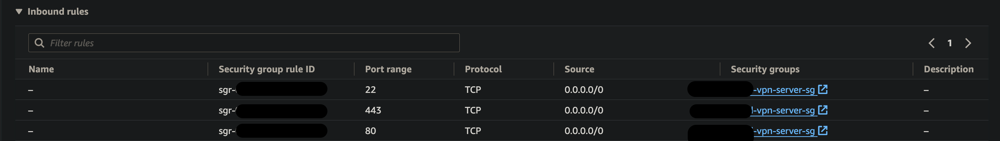
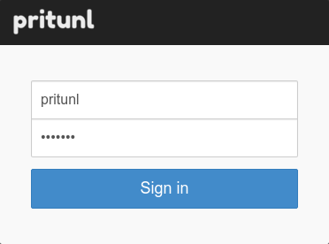
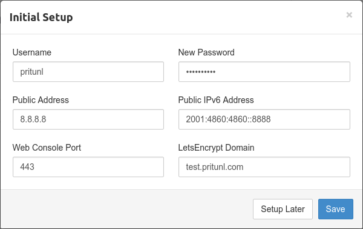

# Set up self-hosted VPN [Pritunl](https://docs.pritunl.com/) on an EC2 Instance

## Pre-requisities

AWS EC2 instance ubuntu 20.04

## Configure security group of the EC2 Instance

In security group, open the port 22 (we will remove it down after), 443, 80

png)

## SSH to VPN EC2 instance

### Install Pritunl on EC2 instance

Import signing key from keyserver

```sh
sudo apt-key adv --keyserver hkp://keyserver.ubuntu.com --recv 7568D9BB55FF9E5287D586017AE645C0CF8E292A
```
(alternative) if keyserver is offline, download from remote repo and import

```sh
curl https://raw.githubusercontent.com/pritunl/pgp/master/pritunl_repo_pub.asc | sudo apt-key add -
```

```sh
sudo tee /etc/apt/sources.list.d/mongodb-org-6.0.list << EOF
deb https://repo.mongodb.org/apt/ubuntu jammy/mongodb-org/6.0 multiverse
EOF
```

```sh
wget -qO - https://www.mongodb.org/static/pgp/server-6.0.asc | sudo apt-key add -
```

```sh
sudo apt update
sudo apt --assume-yes upgrade
```

set up wireGuard server support

```sh
sudo apt -y install wireguard wireguard-tools
```

disable ufw

```sh
sudo ufw disable
```

install pritunl and mongodb

```sh
sudo apt -y install pritunl mongodb-org
```

start pritunl and mongod service

```sh
sudo systemctl enable mongod pritunl
sudo systemctl start mongod pritunl
```

## Configure Pritunl

go to Pritnul UI at http://{public_IP_of_instance}/login#/servers


```sh
sudo pritunl setup-key
```

copy and past the key in UI, check mongodb URI save

the web console will display the login dialog. 

The default username is pritunl, run get the default password

```sh
sudo pritunl default-password
```

After signing in the initial setup dialog will be shown. 



change the username and password



create an organization

